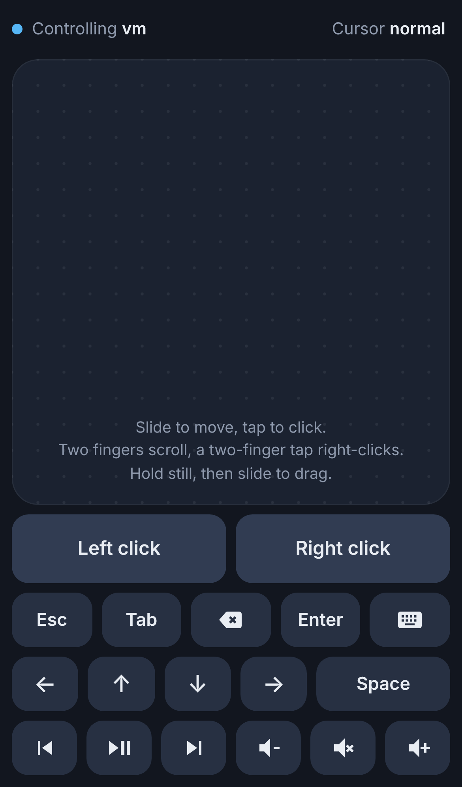

# PocketPad

Use your phone as a wireless trackpad, mouse and keyboard for your PC. No app to install: the PC runs one small Python program, and the phone uses its normal browser.



## Features

- **Trackpad:** slide one finger to move the cursor. Slow movements are precise, fast swipes cross the screen.
- **Clicks:** tap to click, double-tap to double-click, two-finger tap to right-click.
- **Scroll:** slide two fingers, in the same direction as scrolling on the phone itself.
- **Drag:** hold a finger still for a moment, then slide.
- **Keys:** Esc, Tab, Backspace, Enter, Space and the arrow keys. Arrows and Backspace repeat while held.
- **Media:** play/pause, previous, next, volume up, volume down and mute.
- **Typing:** open the phone keyboard and what you type appears on the PC.
- **Cursor speed:** switch between slow, normal and fast.
- **QR pairing:** scan a code shown on the PC and the remote opens. Add it to the home screen to use it like an app.

## How it works

```
Phone browser  ── WebSocket over Wi-Fi ──>  phone_remote.py on the PC  ──>  mouse and keyboard
```

`phone_remote.py` is a single file. It starts a small web server on the PC, serves the remote page to the phone, and listens for touch events over a WebSocket. Each event is turned into real mouse or keyboard input with [pynput](https://pypi.org/project/pynput/). Nothing leaves your local network.

## Requirements

- Python 3.9 or newer on the PC
- The phone and the PC on the same Wi-Fi network
- Three Python packages: `aiohttp`, `pynput`, `qrcode`

## Getting started

Open a terminal in the project folder on the PC and run:

```
python -m pip install aiohttp pynput qrcode
python phone_remote.py
```

A page with a QR code opens on the PC. Point the phone camera at it and tap the link. If Windows Firewall asks, allow access on private networks.

On Windows you can also double-click `Start Remote.bat`, which runs the same two commands. If Smart App Control blocks the downloaded batch file, use the terminal commands above instead.

To keep the remote handy on an iPhone, open it in Safari and choose Share → Add to Home Screen.

## Options

| Option | What it does |
| --- | --- |
| `--port 9000` | Use a different port (default is 8765) |
| `--no-browser` | Do not open the QR page on the PC at start |
| `--new-key` | Create a new link; phones paired before must scan again |
| `--dry-run` | Print what the phone sends instead of moving the mouse |

## Security

The link in the QR code contains a private key, and the PC ignores any connection without it. The key is saved in `remote.key` next to the script so a home-screen shortcut keeps working. Anyone on your Wi-Fi who has the full link can control the PC, so do not share the QR code or commit `remote.key`. Run with `--new-key` to invalidate old links.

The connection is plain HTTP on the local network. Use it on a Wi-Fi network you trust.

## Limitations

- The remote works only while `phone_remote.py` is running on the PC.
- Windows does not let a normal program click inside administrator prompts. Start the remote as administrator if you need that.
- Developed for a Windows mini PC. pynput also supports macOS and Linux, where the remote should work with the right input permissions (Accessibility on macOS).
- On Linux, typed letters are delivered to the focused window in a way some applications ignore.

## Built with

Python, aiohttp, pynput, and plain HTML, CSS and JavaScript for the phone page.
